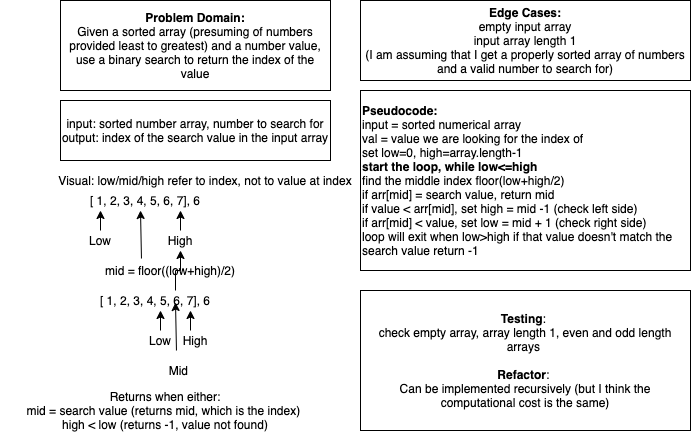

# Challenge Summary
Write a function called BinarySearch which takes in 2 parameters: a sorted array and the search key. Without utilizing any of the built-in methods available to your language, return the index of the array’s element that is equal to the search key, or -1 if the element does not exist.

## Challenge Description
Use binary search without utilizing built in array methods to return the index of a given value provided a sorted array and a value to search for. In this challenge I am assuming that a receive legitimate input: an in order, least to greatest sorted array of numbers and a number value to search for.

## Approach & Efficiency
Implemented using a while loop that bisects the array on each iteration and compares the target value to the mid value of the bisected array; ultimately the loop will terminate when the bisected array reaches a length of 1 or the value is matched.

The array is halved each time the loop iterates, so the worst case scenario is O(log n).

## Solution

