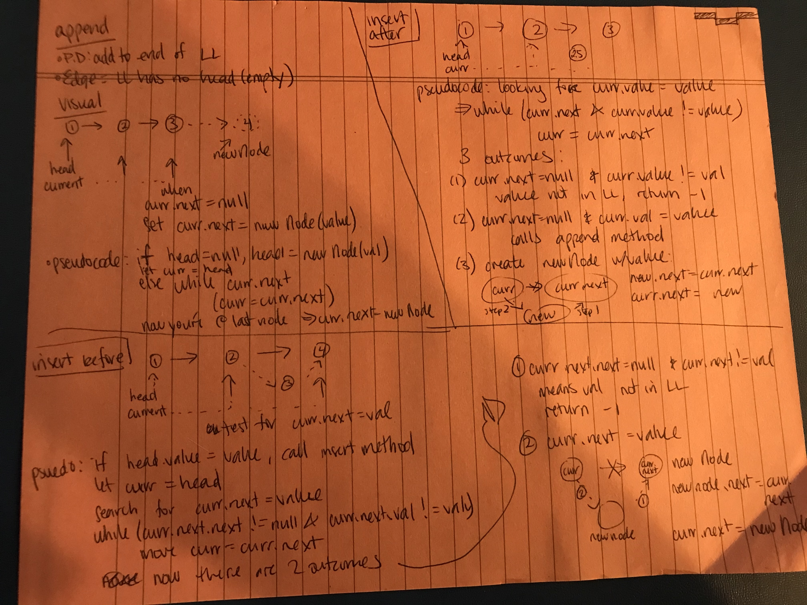

# Singly Linked List
Implementation of a singly linked list. A linked list object will instantiate a new linked list with an empty (null) head. Nodes can be instantiated and added to the linkedlist object using the available object methods:

- ```append```: add to tail
- ```delete```: removed node containing parameter value or returns -1 if value not found
- ```includes``` returns boolean representing if input value is present in linked list
- ```insert```: creates new node, adds to head
- ```insertAfter```: creates a new node, inserts it after the node containing the param value
- ```insertBefore```: creates a new node, inserts it before the node containing the param value
- ```toString```: returns string representation of linked List

## Challenge
Created LinkedList and Node classes, add functionality as outlined above to the LinkedList class. A more descriptive summary of the classes is provided via the JS Docs link below which will outline all functions, params, and potential return values.

## Approach & Efficiency
Linked list traversal methods (including all that are methods of this Linked List implementation) have a worst case scenario of O(n) time complexity. Space complexity is O(1), only requiring the additional space needed to create the new node.

### Linked List Object Methods

| Method | Description | Time Complexity | Space Complexity
------ | ----------- | --------------- | ----------------
| ```append``` | adds a node to the tail (end) of linked list) |  O(n) | O(1)
| ```delete ``` | deletes the node with the input val or returns -1 if not found | O(N) | O(1)
| ```includes``` | returns boolean representing if param value is found in linked list | O(n) | O(1) ? I think, it's not creating anything new, just returning a boolean
| ```insert``` | adds a node to the head of the linked list | O(1) | O(1)
| ```insertAfter``` | creates a new node, inserts it after the node containing the param value | O(N) | O(1)
| ```insertAfter``` | creates a new node, inserts it before the node containing the param value | O(N) | O(1)
| ```toString``` | returns string representation of linked list | O(n) | O(1)

## API / Whiteboard
[JS Docs](https://annethor.github.io/data-structures-and-algorithms/out/linked-list.js.html)

