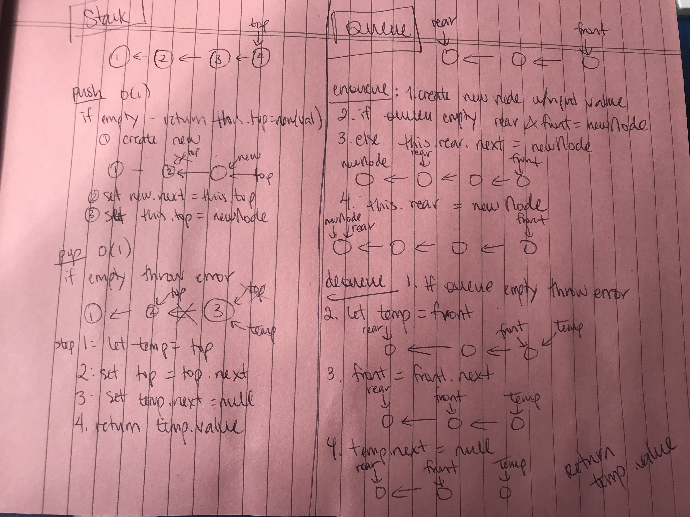

# Stacks and Queues
Stack and Queue object implementations

## Challenge

### Stack Methods

Method | Complexity
------ | ----------
```push(value)``` create node with new value, add it to top of stack | O(1), always the same, doesn't depend on size of stack
```pop()``` removes and returns a node from the stack (popping an empty stack throws an exception) | O(1)
```top``` reference to top of stack | n/a
```peek()``` returns value of the top node (throws exception when peeking an empty stack) | O(1), remember to call ```isEmpty()``` first
```isEmpty()``` returns boolean of whether stack is empty | O(1)

### Queue Methods

Method | Complexity
------ | ----------
```enqueue(value)``` create node with input value, add to back of queue | O(1) does not depend on size of existing queue
```dequeue()``` removes item from front of queue, throws exception if empty | O(1), remember to call ```isEmpty()``` first
```front()``` reference to front node of queue | n/a
```rear()``` reference to last node in the queue | n/a
```peek()``` returns value of ```front``` node | O(1)
```isEmpty()``` returns boolean of if queue is empty | O(1)

## Approach & Efficiency
Summary above and JS Docs links below

## API / Whiteboard

[JS Docs - Stack](https://annethor.github.io/data-structures-and-algorithms/out/stack.js.html)

[JS Docs - Stack](https://annethor.github.io/data-structures-and-algorithms/out/queue.js.html)


