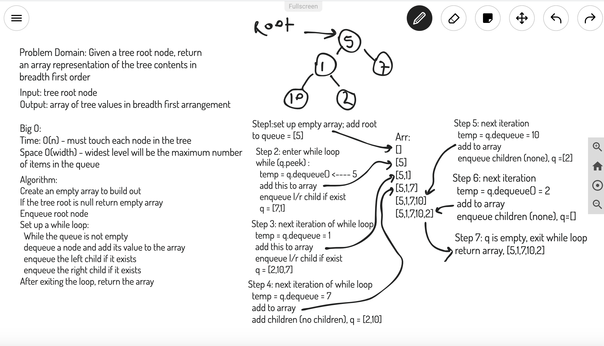

# Binary Tree Breadth

## Challenge Description

Create a method, here it is called ```breadthFirst``` that returns an array of the tree contents printed in breadth first order (meaning top level, then first children, then second children, etc.)

## Approach & Efficiency

I used an iterative approach here that takes the tree root as the input and pops it on a queue. While the root has children, these are added to the queue from left to right. A while loop runs while the queue still has contents such that as nodes are added to the back, they are dequeued from the front and their values added to the result array, which is returned after exiting the while loop

Big O(time) = O(n) it traverses every node in the tree

Big O(space) = O(w) the level of the tree with the most nodes in it will determine the largest number of calls on the stack

[JS Docs - Binary Tree](https://annethor.github.io/data-structures-and-algorithms/out/BinaryTree.js.html)

## WHITEBOARD


