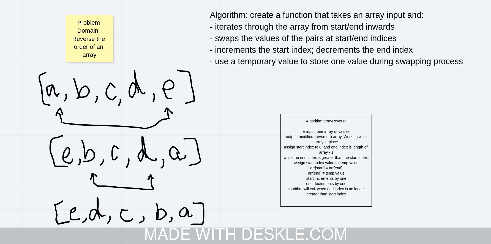

# 401 Data Structures, Code Challenges

**[Challenge 1: Array Reverse](#reverse-an-array)**

## Reverse an Array

### Challenge
An algorithm that takes an array (of any type) as an input and returns the array in place with a reversed order of objects

### Approach & Efficiency
I used a temporary value and a while conditional statement to swap the first and last values of the array using the first/last indices of the array as markers and incrementing/lessenin the values in each interation while the end value was greater than the start. This accounts for both odd and even numbered values of array lengths.

BigO is n/2, the while loop will run a maximum of n/2 times as each iteration deals with 2 array values

### Solution

