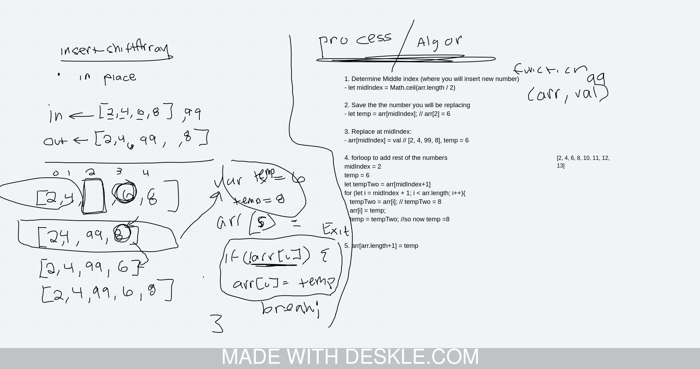

# Insert Value Into Array

## Challenge Summary
An algorithm that accepts as parameters an array of anything and a value and inserts the value into the array in the middle index (in place without using pre existing array methods).

## Challenge Description
An algorithm that accepts as parameters an array of anything and a value and inserts the value into the array in the middle index (in place without using pre existing array methods).

## Approach & Efficiency
The first step is to find the middle index of the array for even or odd length input arrays. Then we pull the middle index value into a temporary value and replace with the paramter input. A for loop iterates through the second half of the array shifting the temporary value until the final postion, which we add to the end of the array, extending the length by 1 position. Edge cases for empty arrays and arrays of length 1 are handled in initial checking conditionals.

The for loop will run n/2 times maximum, so Big O notation would be n/2.

## Solution

