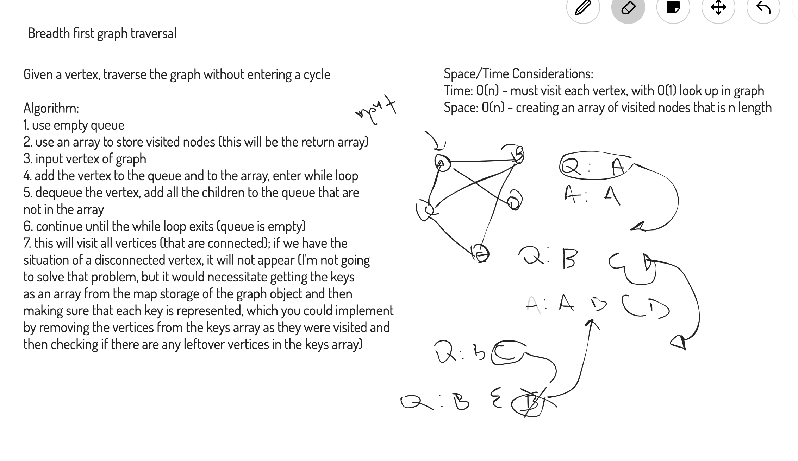

# Repeated Words

## Challenge
Extend the graph class to include a breadth first traversal method.

## Approach & Efficiency
Whiteboard picture below has summary of algorithm.

Time: O(n) - time to visit every vertex in the graph, O(1) lookup from internal map
Space: O(n) - creating an array of nodes for the return

## API
[Edge - JSDocs](https://annethor.github.io/data-structures-and-algorithms/out/edge.js.html)

[Graph - JSDocs](https://annethor.github.io/data-structures-and-algorithms/out/graph.js.html)

[Vertex - JSDocs](https://annethor.github.io/data-structures-and-algorithms/out/vertex.js.html)

## Whiteboard

