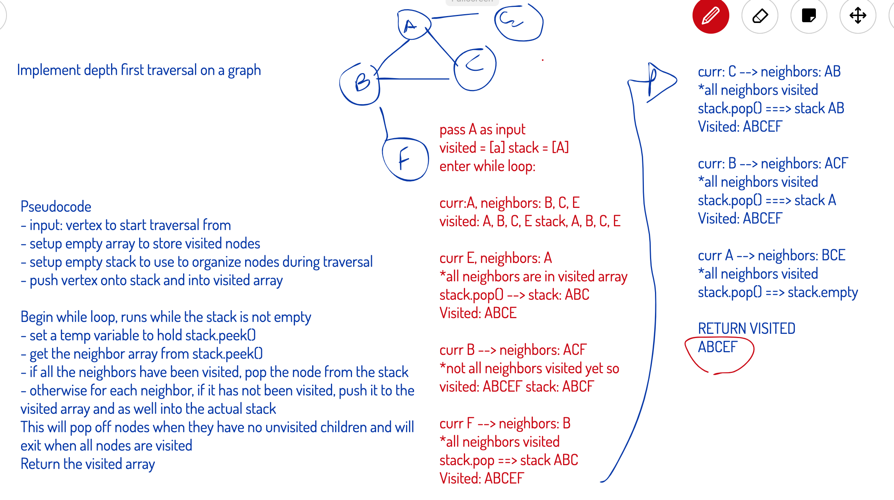

# Depth First Graph Traversal

## Challenge
Extend the graph class to include a depth first traversal method.

## Approach & Efficiency
Depth First: Uses a stack similarly to how the depth first uses a queue

Basic Steps to Implement:

1. Push the root node into a stack, create an empty array for visited nodes
2. Start a while loop while the stack is not empty
3. Peek at the top node in the stack
4. If the top node has unvisited children, mark the top node as visited
and push the unvisited children back on the stack
5. If the top node does not have unvisited children pop it off the stack
Repeat until stack is emptied

## Complexity Considerations

**Time**
Every node must be visited so that is O(n); array lookup to check visited status is O(1), utilizing the stack is
O(1), so totally **O(n)**

**Space**
We are using a stack, that will have max O(n) calls on it at any time (worst case scenario would be a
graph that was a linked list) and an array to mark visited children that will be max n length, so
totally **O(n2)**

## API Documentation for Graph and Associated Classes
[Edge - JSDocs](https://annethor.github.io/data-structures-and-algorithms/out/edge.js.html)

[Graph - JSDocs](https://annethor.github.io/data-structures-and-algorithms/out/graph.js.html)

[Vertex - JSDocs](https://annethor.github.io/data-structures-and-algorithms/out/vertex.js.html)

## Whiteboard

