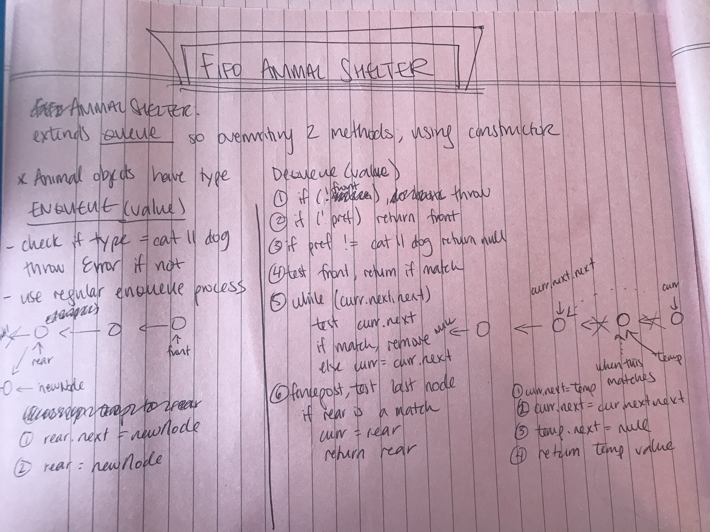

# FIFO Animal Shelter

## Challenge

Implement an AnimalShelter Class that uses first in, first out approach, and accepts only Animal objects of type 'cat' or 'dog'

### FIFO ANIMAL SHELTER METHODS

Method | Space Complexity | Time Complexity
------ | ---------------- | ---------------
```enqueue(value)``` checks validity of input, create node with new value, add it to the rear position in the queue (in this implementation that is the bottom position of the storage stack); returns updated queue | O(1) space complexity - only requires additional space to create the new node | O(1) it just reassigns the rear value of the queue, no iteration
```dequeue(pref)``` removes the type of the "first" node from the queue (i.e. 'cat' or 'dog'); throws an exception if trying to dequeue from an empty queue; if no preference is given, the animal at the front position of the queue is dequeued | O(1) space complexity, we aren't adding any space, just waiting for garbage removed to come get the old node | O(n) time complexity, worst case scenario is you're looking for the rear position

## Approach & Efficiency
Summary above and JS Docs links below

## API / Whiteboard

[JS Docs - FIFO Animal Shelter](https://annethor.github.io/data-structures-and-algorithms/out/fifo-animal-shelter.js.html)

[JSDocs - Animal Shelter](https://annethor.github.io/data-structures-and-algorithms/out/AnimalShelter.js.html)


