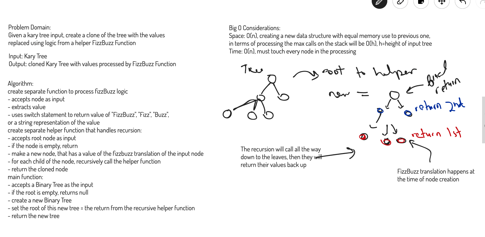

# Fizz Buzz K-Ary Tree

## Challenge

Given a k-ary tree storing number values, return a clone of the tree with the same structure, but with the contents changed with a FizzBuzz function with logic as follows:

### FizzBuzz Transforms
- If a value is divisible by 15, transform to "FizzBuzz"
- If a value is divisible by 5, transform to "Buzz"
- If a value is divisible by 3, transform to "Fizz"
- Otherwise, return a string representation of the number

### Methods

Method | Description | Space Complexity | Time Complexity
------ | ----------- | ---------------- | ---------------
```FizzBuzzTree(tree)``` | a method that accepts a BinaryTree object as an input and passes it's node to a helper function to create a clone with FizzBuzz alterations; returns the cloned tree | O(1) | O(1) |
```FizzBuzzTreeHelper(node)``` | accepts the root node of a Binary Tree and traverses the k-ary tree recursively, passing each node to a FizzBuzz translator function and then adding it to the clone tree | O(h) | O(n) |
```fizzBuzz(node)``` | extracts the value from the node, then uses a switch statement to process it according to the fizzBuzz logic described above | O(1) | O(1)

### Big O Considerations

Overall, I believe this function is operating at **O(n) time complexity** as it must process each node individually and process each one.

Overall here we have **O(n)** space complexity because we are creating and returning a new data structure that is equal in size to the original input

## Approach & Efficiency
Summary above and JS Docs links below

## API / Whiteboard

[JS Docs - fizz-buzz-tree](https://annethor.github.io/data-structures-and-algorithms/out/fizz-buzz-tree.js.html)


