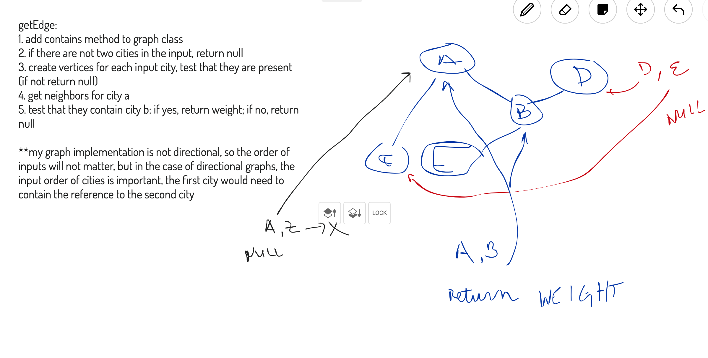

# Get Edge

## Challenge
Imagine we have a graph of city vertices that are connected with weighted edges.

Given the graph input and an array of two cities, return the fare (weight) connecting
the two cities, or null if there is no direct connection.

## Approach & Efficiency
The algorithm steps are as follows:

- added a contains method to the graph to accept a vertex and return a boolean indicating if it is in the graph

`getEdge` operates as follows
1. If there are not two cities in the input array return null
2. Create vertices for each input city and test that they both are present in the graph (return null if they are not)
3. Get the neighbors for the city at index 0 in the input array
4. If the city from the 1st index of input array is in the neighbors, return the edge value, else return null

**Space/Time Complexities**

Time: O(n) - it is constant lookup time from the graph, but we have to filter the entire neighbors array, which in the worst case scenario (or a fully connected graph) can contain every single node

Space: O(n) - space to construct the neighbors array

## API

[Graph - JSDocs](https://annethor.github.io/data-structures-and-algorithms/out/graph.js.html)

[getEdge - JSDocs](https://annethor.github.io/data-structures-and-algorithms/out/getEdge.js.html)

## Whiteboard

