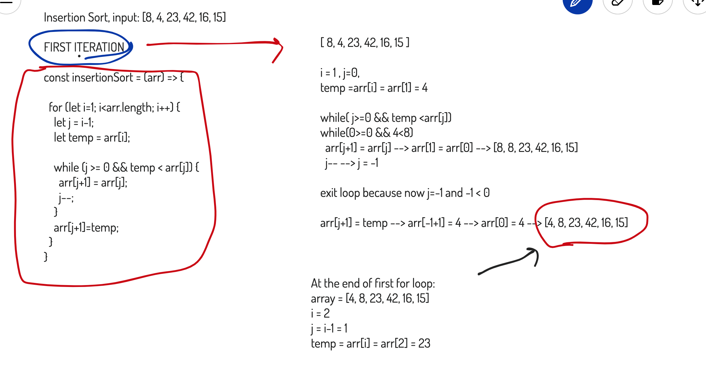
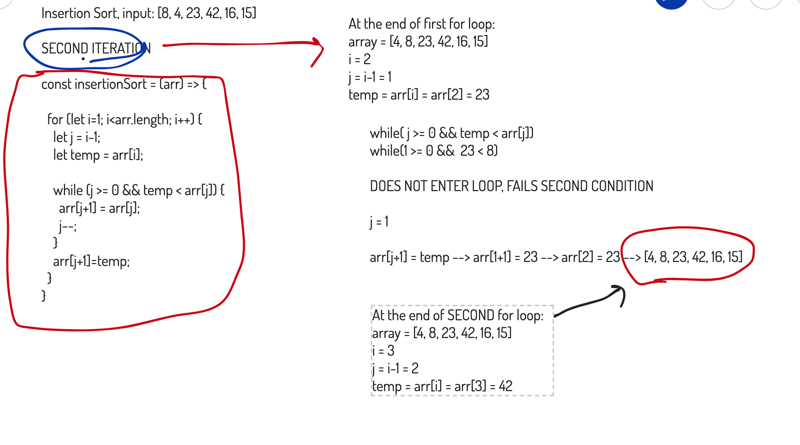
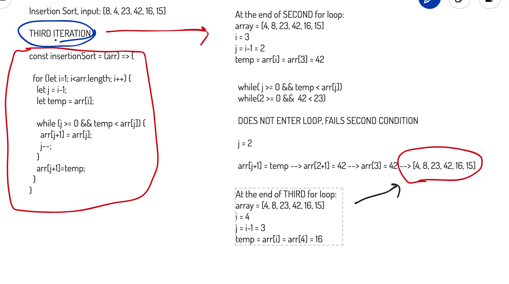
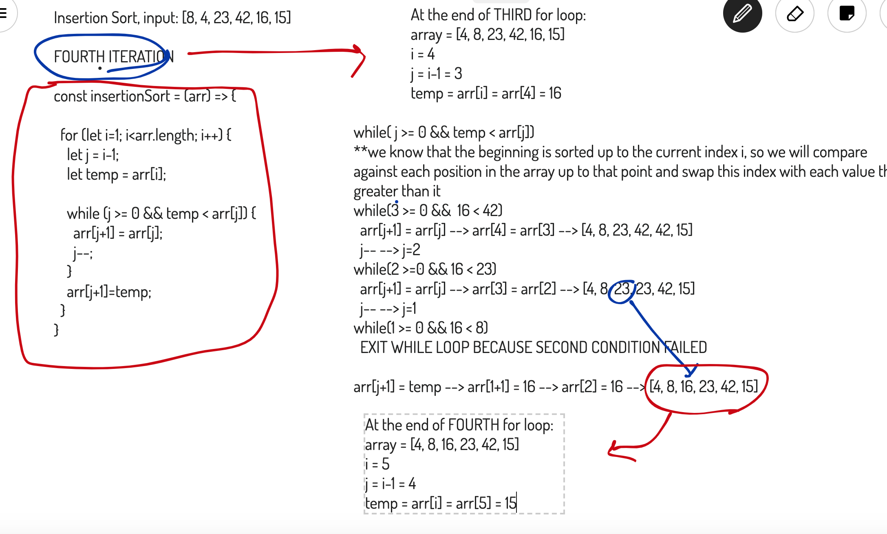
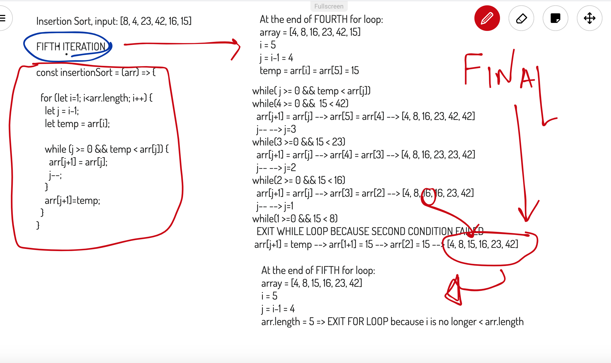

# Insertion Sort

Insertion sort works by looping through the array and doing the following:

- setting two markers i and j
- saving i as a temporary value
- j marks the index where the temp value will be reinserted
- i keeps track of the point where the temporary value is no longer larger than the value at the index

## Considerations

This function has a while loop inside a for loop, and the worst case scenarios are:

Big(O) Time: n^2
Big(O) Space: 1 (only does 1 operation at a time, nothing on the stack)

Best case scenario (only one swap or zero swaps needed, this would be O(n) for time and O(1) for space).... but we don't judge on the best case scenarios :)

## Code

[JsDoc for Insertion Sort Implementation]((https://annethor.github.io/data-structures-and-algorithms/out/insertionSort.js.html))

## Step by Step Example of Insertion Sort

Below is a step by step walk through of the entire Insertion Sort Process for the input array of `[8, 4, 23, 42, 16, 15]`

### Iteration One

### Iteration Two

### Iteration Three

### Iteration Four

### Iteration Five

