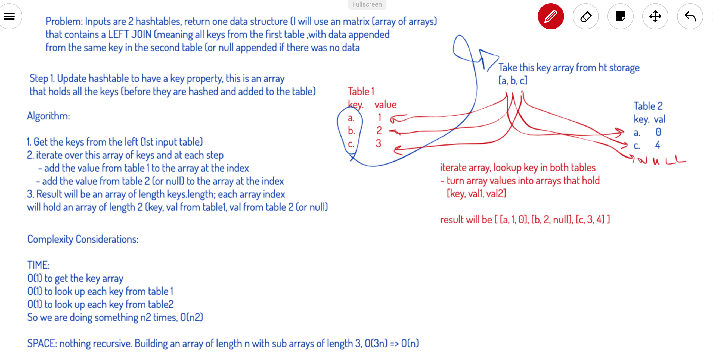

# Repeated Words

## Challenge
Take two hash tables and implement a left join (mock SQL implementation). The output data structure will be a matrix of arrays, each array will contain the key from the left table, the value at this key in the first table, and the value (if any) at this key from the second table (or null if there is not one).

## Approach & Efficiency
Added a keys array to the hashtable object to make it possible to query the hashtable for all existing values inside of it.

Taking this keys array, loop over the indexes and create a new array of arrays that will hold at each index an array of length 3: `[key, val from table 1, val from table 2 || null]`

Time: O(2n) => O(n) as n -> infinity; where n is the length of the keys array of the first table (as you will have to look up each value from table 1 and table 2)

Space: added space to hash table implementation as it now also houses an auxiliary array of size n. In terms of the actual join operation, that will be the space to construct the array of length 3n => O(n) as n -> infinity

## Solution
[JS Docs for Left Join](https://annethor.github.io/data-structures-and-algorithms/out/leftjoin.js.html)

