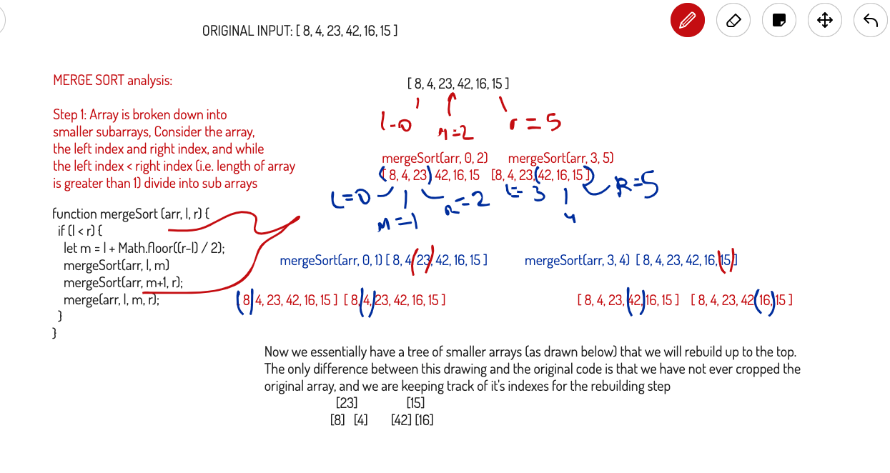
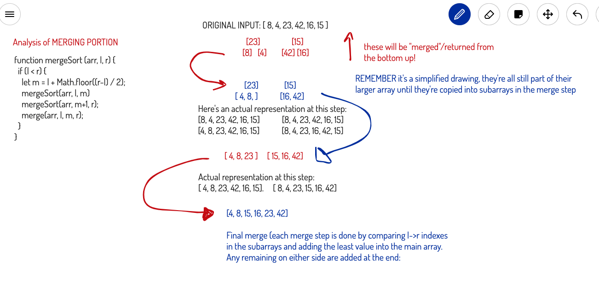
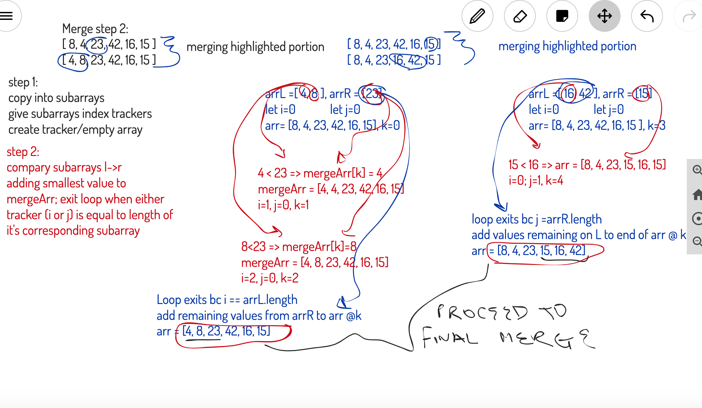
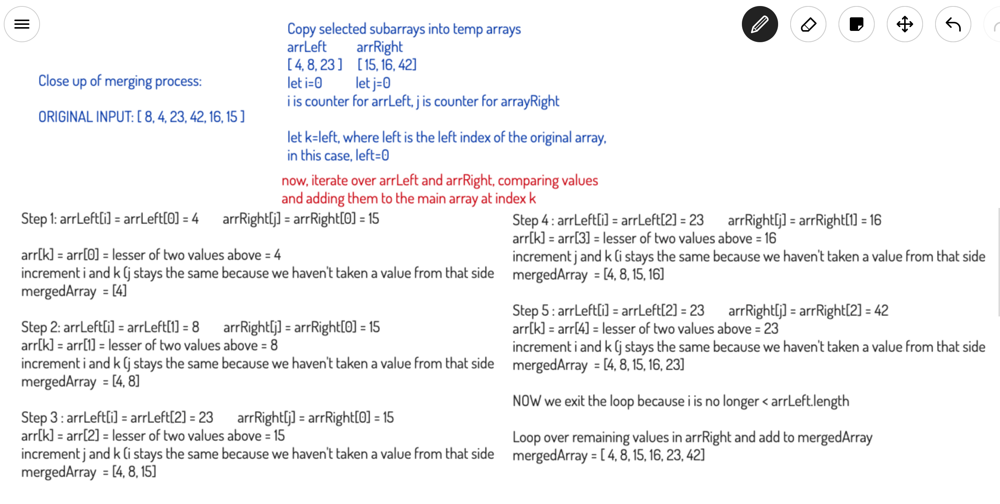

# Merge Sort

Merge sort works by diving the array in half recursively until all elements are isolated and then calling a merge helper function to reassemble the arrays in pairs until one array of the original size, in ascending order, remains. The array is modified in place, so when it is being "split" we are actually just narrowing it down into subarrays defined by their left, right and mid index.

## Considerations

First the recursive call will divide each subarray in half until all elements are isolated in subarrays of length 1. This halving operation will have a Big(O) Time notation of logn. Then the merging operation must compare all elements to ensure they are inserted back at the proper index, an operation that takes Big(O) Time notation of n.

Therefore the **total** Big(O) Time Complexity of this operation is **nlog(n)**

The space complexity of this algorithm (sorting in place) is O(n) because you have to store the array in sub arrays while you reassemble it.

## Code

[JsDoc for Insertion Sort Implementation]((https://annethor.github.io/data-structures-and-algorithms/out/mergeSort.js.html))

## Step by Step Example of Merge Sort

Below is a step by step walk through of the entire **Merge Sort** Process for the input array of `[8, 4, 23, 42, 16, 15]`

### High Level Step One

### High Level Step Two

### Detail of Merge Step

### Details of Final Merge Step

