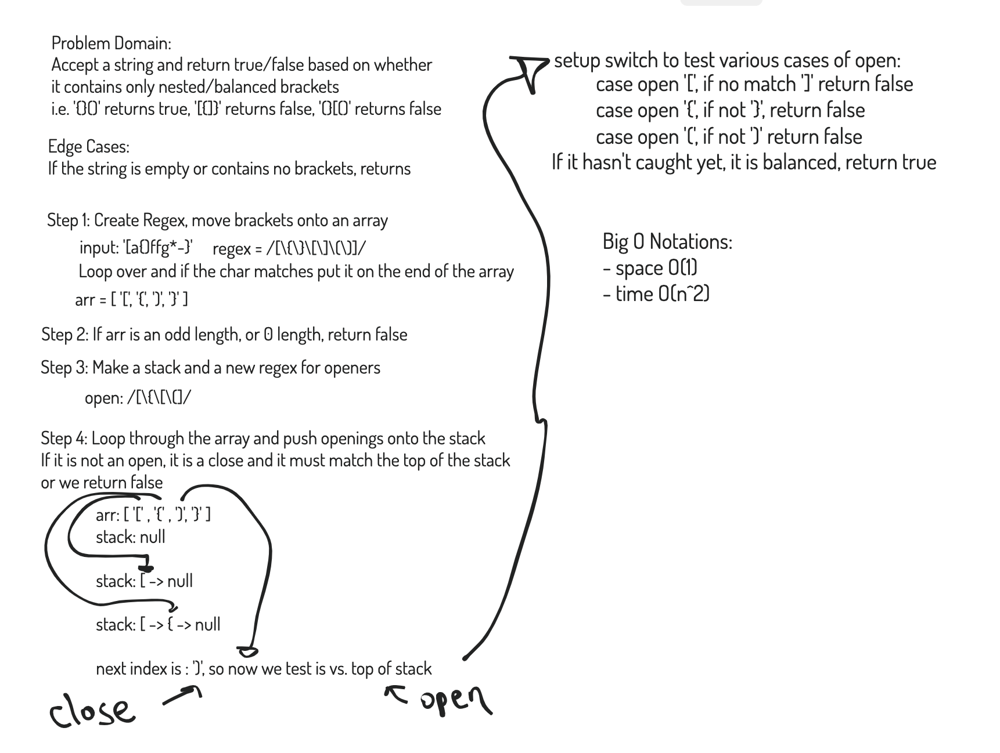

# Multi Bracket Validation

## Challenge

Create a function that takes a string as its only argument, and returns a boolean representing whether or not the brackets in the string are balanced. There are 3 types of brackets:

Round Brackets : ()
Square Brackets : []
Curly Brackets : {}

Example syntax:

Input	| Output
----- | ------
{} |	TRUE
{}(){} |	TRUE
()[[Extra Characters]] |	TRUE
(){}[[]] |	TRUE
{}{Code}[Fellows](()) |	TRUE
[({}] |	FALSE
(]( |	FALSE
{(}) |	FALSE

## Approach & Efficiency
The function first transfers all the brackets in the input string into an array (by looping over the entire string by character using a regular expression to match any opening or closing bracket in the found set of []{}() ).

If the resultant bracket array is an uneven length or is empty, we know that the brackets are not balanced and we return false.

The function then loops over the bracket array, pushing all opening brackets onto a stack.

If a closing bracket occurs before any opening bracket it will return false. When a closing bracket is encountered in the array, the stack is popped and if the opening bracket from the stack does not match the closing bracket the function returns false. If all opening brackets are successfully removed from the stack with the matching closing bracket, the function returns true.

## API / Whiteboard

[JS Docs - Multi Bracket Validation](https://annethor.github.io/data-structures-and-algorithms/out/multi-bracket-validation.js.html)

