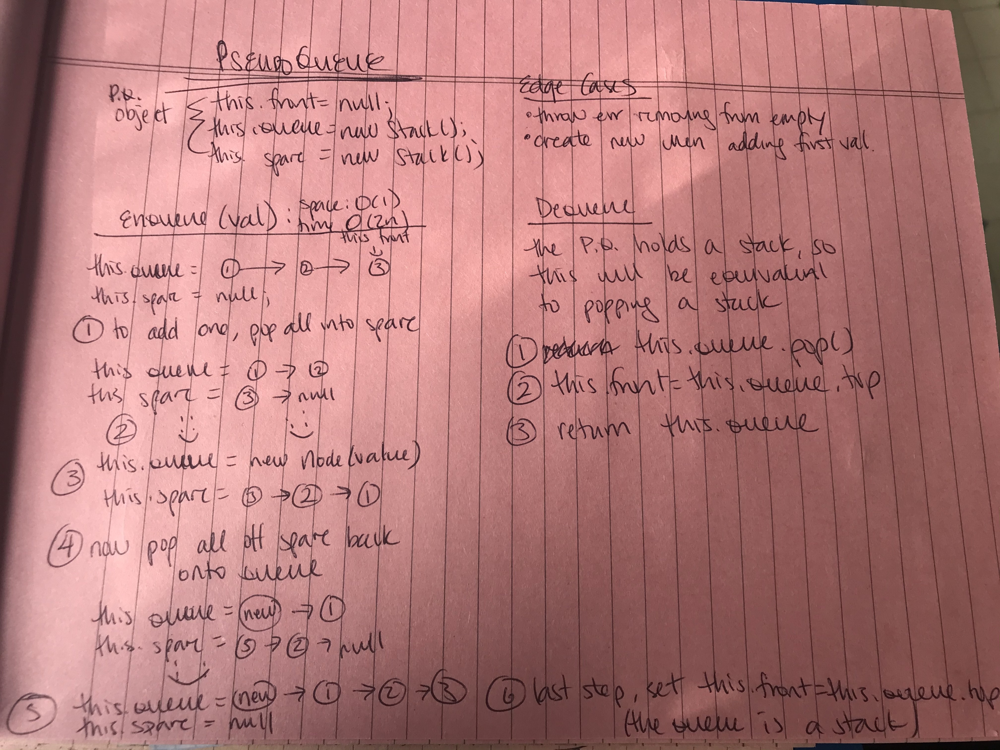

# A Queue Built From Stacks

## Challenge

Implement a Queue with ```enqueue()``` and ```dequeue()``` methods using two stacks

### Stack Methods

Method | Space Complexity | Time Complexity
------ | ---------------- | ---------------
```enqueue(value)``` create node with new value, add it to the rear position in the queue (in this implementation that is the bottom position of the storage stack); returns updated queue | O(1) space complexity - only requires additional space to create the new node | O(2n) time complexity, the solution iterates over n nodes in the existing queue two times
```dequeue()``` removes the "first" node from the queue (in a first in, first out arrangement); returns the shortened queue or throws an exception if trying to dequeue from an empty queue | O(1) space complexity, we aren't adding any space, just waiting for garbage removed to come get the old node | O(2) time complexity, this is just just popping off the top of the stack; we then set the new top of the stack to this.front


## Approach & Efficiency
Summary above and JS Docs links below

## API / Whiteboard

[JS Docs - Queue Built From 2 Stacks](https://annethor.github.io/data-structures-and-algorithms/out/queue-with-stacks.js.html)


