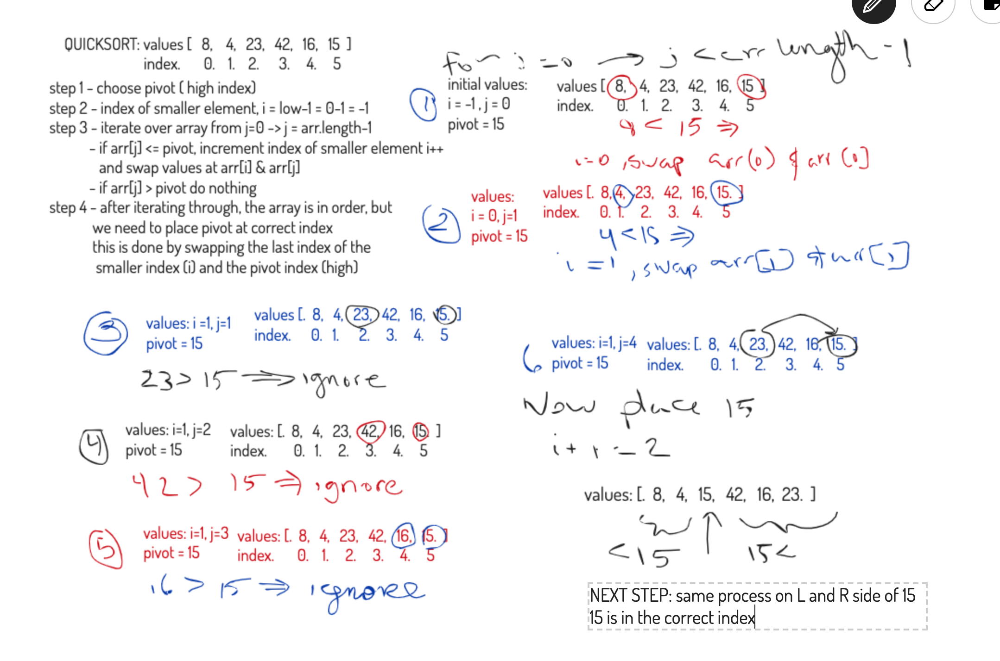
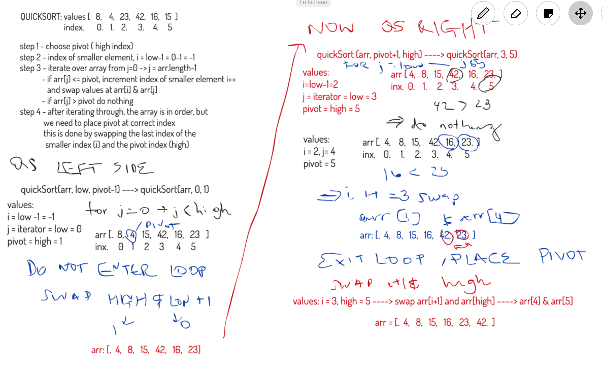

# Quick Sort

Quick sort chooses a pivot (in this case the original pivot is last index array, but it will work the same if you choose the first index or a random index).

The first step is to place the pivot in the correct index of the array, this is done by making a passover of the array with two tracking values: J is the iterator value, which tracks from the low index to 1 less than the high index (pivot). The second is the I value, initiated at 1 less than the low index, this will track the last index that is less than the pivot. As we iterate over the array, if the value at J is less than the pivot, we will increment I and swap the values arr[I] and arr[J]. This ensures that anything less than the pivot will be stored in the index from arr[0] - arr[I]. When the loop exits, the pivot is swapped with the value at arr[I++]. Now, the pivot is in the correct index (larger values to R, smaller to L) and this new pivot location is returned.

The sort is completed by running the same sorting algorithm over the L and R sides with the updated pivot value as follows:

to sort the L side --> quickSort(arr, low, high) ====> quickSort(arr, low, pivot-1)
to sort the R side --> quickSort(arr, low, high) ====> quickSort(arr, pivot+1, high)

where: `arr` is the original array, `low` is the lowest index in the subarray you're sorting, `high` is the highest index in the subarray you are sorting and `pivot` is the index of the pivot returned from the first passover

After the L and R sides are sorted, the array is completely sorted in place.

## Considerations

Quicksort sorts the array in place, after partitioning, the partition is recursively called, so the space consideration is O(logn) - if it is carefully implemented and uses tail recursion.

The first pass of Quicksort compares every value, therefore has a runtime O(n). The subsequent passes compare again each side, which will have a runtime of O(n) again. Therefore the **total** time complexity if O(n^2). However, that estimation only applies in the worst case scenario where every value must be swapped, the average runtime is O(nlogn)

## Code

[JsDoc for QuickSort Implementation]((https://annethor.github.io/data-structures-and-algorithms/out/quickSort.js.html))

## Step by Step Example of Quick Sort

Below is a step by step walk through of the entire **Quick Sort** Process for the input array of `[8, 4, 23, 42, 16, 15]`

### Step One - FIRST PASSOVER and return of pivot

### Step Two - SORTING OF LEFT AND RIGHT SIDES

