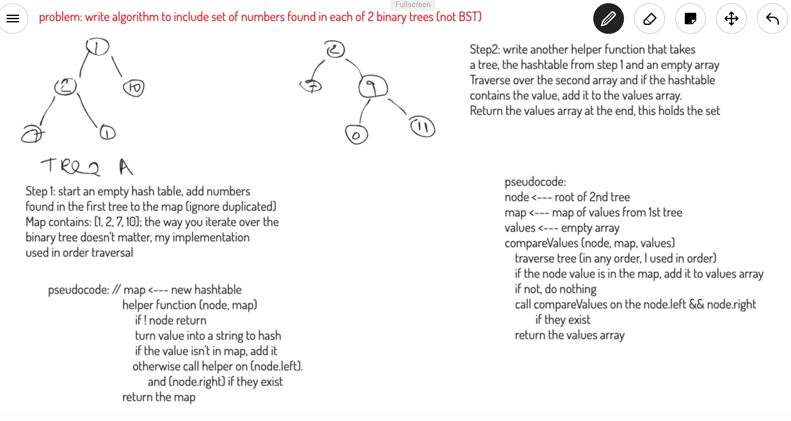

# Repeated Words

## Challenge
Write a function that compares two binary trees and returns the set of numbers that is contained in each.

## Approach & Efficiency
The function:
- uses a hashmap to record the values in treeA
- traverses treeB and adds values found in the map to
a values array
- returns the values array that contains the set of numbers contained in each

The cost of loooking up/entering in the hashtable is O(1), but we still have to traverse the entirety of both trees so the total time complexity is O(n + m).

The space complexity is the cost to create the hashtable and the cost to create the return array. The maximum size would be the size of the smaller tree. O(2n)

## Solution
[JS Docs for treeIntersection](https://annethor.github.io/data-structures-and-algorithms/out/treeIntersection.js.html)

